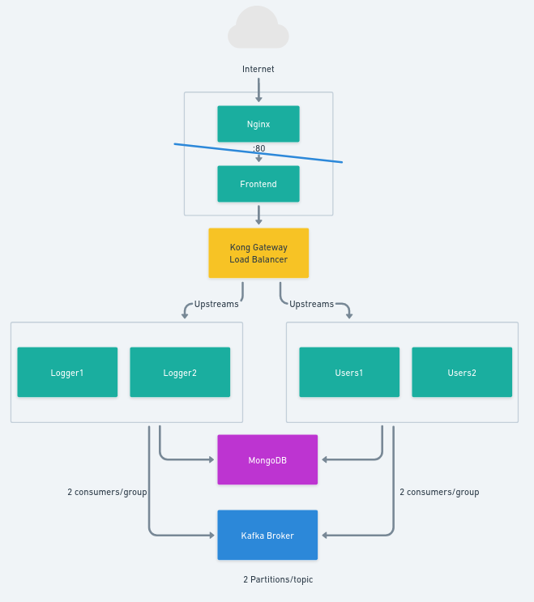

### Desafio Pleno CERTI

## Visão Geral

Este projeto tem como objetivo gerenciar usuários da aplicação e gerar logs não estruturados. Trata-se de uma aplicação distribuída em uma topologia de microserviços.

## Serviços

`Frontend`: Uma aplicação web Angular SPA.

`Logger1`: Um microserviço de registro de logs que registra mensagens consumindo o tópico Kafka logs.create.

`Logger2`: Um microserviço de registro de logs que registra mensagens consumindo o tópico Kafka logs.create.

`Users1`: Um microserviço para gerenciar contas de usuários, com uma API REST. Usa Kafka e produz para o tópico logs.create.

`Users2`: Um microserviço para gerenciar contas de usuários, com uma API REST. Usa Kafka e produz para o tópico logs.create.

`Mongo`: Uma instância do banco de dados MongoDB.

`Zookeeper`: Uma instância do Zookeeper para gerenciar os brokers Kafka.

`Broker`: Uma instância do broker Kafka.

Veja uma descrição mais detalhada no `README.md` de cada aplicação.

## Configuração

`Frontend`

- Port: 80

`Logger1`

- Port: 3002
- Consumes Kafka Topic: logs.create
- Kafka Consumer Group ID: logs-consumer

`Logger2`

- Port: 3003
- Consumes Kafka Topic: logs.create
- Kafka Consumer Group ID: logs-consumer

`Users1`

- Port: 3000
- Produces on Kafka Topic: logs.create

`Users2`

- Port: 3001
- Produces on Kafka Topic: logs.create

`Mongo`

- Port: 27017

`Zookeeper`

- Port: 2181

`Broker`

- Port: 9092
- Kafka Topic logs.create 
  - Configuration:
    - Name: logs.create
    - Partitions: 2
