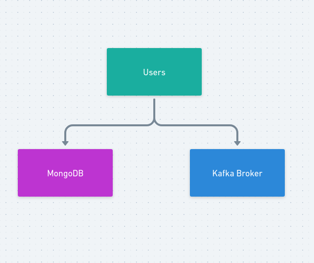
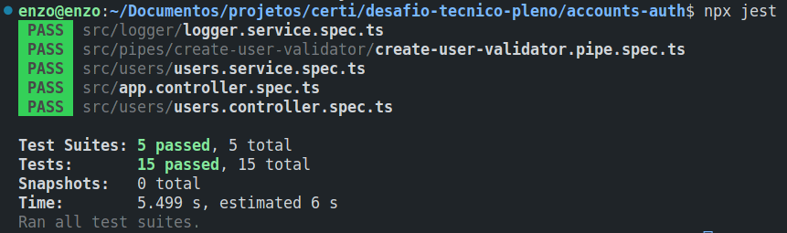

# Microserviço de Gerenciamento de Usuários

## Visão Geral

Este microsserviço é responsável por gerenciar as operações relacionadas aos usuários de um sistema, incluindo a criação, deleção, atualização e listagem de usuários. Para garantir a eficiência e escalabilidade do sistema, o microsserviço utiliza o banco de dados MongoDB.

Além disso, todas as operações realizadas pelo microsserviço são registradas em um microsserviço separado de gerenciamento de logs, para facilitar a detecção de erros e a resolução de problemas.

### Este microsserviço possui

- Testes unitários de serviços com banco de dados real
- Testes unitários de validação de DTOs

### Como executar os testes

Para executar os testes, siga os seguintes passos:

1. Suba o container do MongoDB usando o comando `docker-compose up -d mongo`
2. Execute `npx jest` no terminal

### Tecnologias Utilizadas

- Nest.js
- MongoDB
- Jest (para testes)
- Kafka
