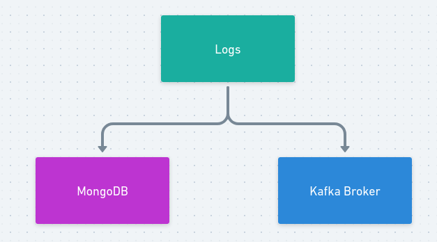
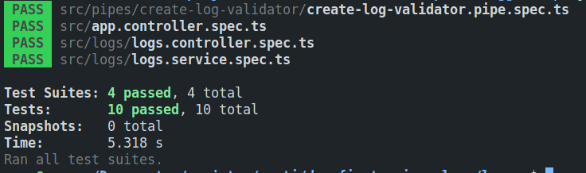

# Microserviço de Gerenciamento de Logs

## Visão Geral

> Este microserviço tem como objetivo gerenciar logs não estruturados de aplicações distribuídas em uma topologia de microserviços. Ele se conecta ao Broker do Kafka para inserir os logs no banco de dados MongoDB assim que as mensagens chegam no tópico logs.create. Utiliza o banco de dados MongoDB devido à sua natureza não relacional, que é mais eficiente para armazenar dados não estruturados.

### Este microsserviço possui

- Testes unitários de serviços com banco de dados real
- Testes unitários de validação de DTOs

### Como executar os testes

Para executar os testes, siga os seguintes passos:

1. Suba o container do MongoDB usando o comando docker-compose up -d mongo
2. Execute npx jest no terminal

### Tecnologias Utilizadas

Nest.js
MongoDB
Jest (para testes)
Kafka
